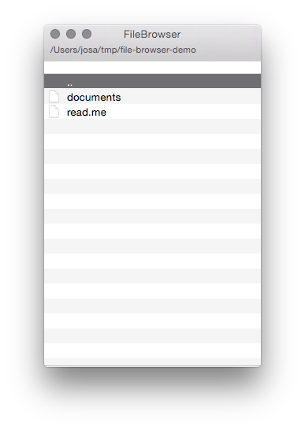

# File Browser

This is a simple, fast file browser, designed to be used with the keyboard.

**Features**

* Just start typing to select file or folders
* *Enter*: Open folder
* *Shift + enter*: Open file deafult Application
* *Alt + enter*: Open folder in Finder
* *CMD + Shift + h*: Toggle show invisible files

Still work in progress...

